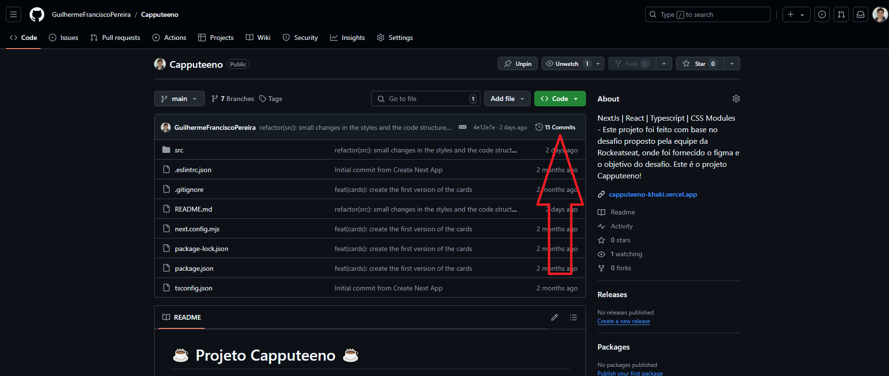
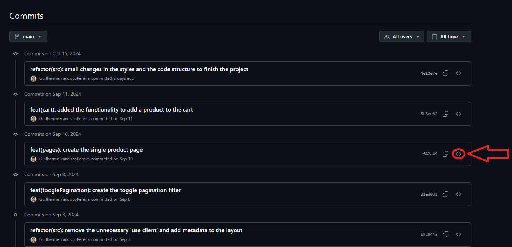
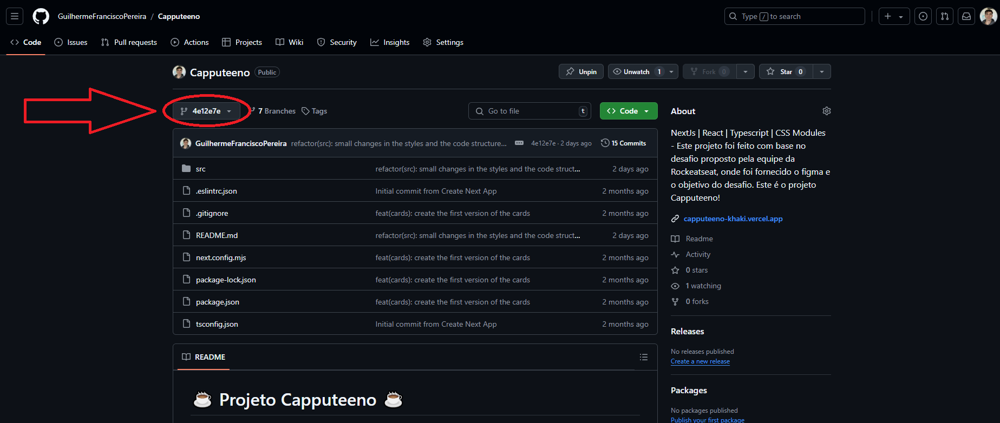

<p align="left">
  <a href="./README.md">
    
  </a>
</p>

# 🚀 Capputeeno Project 🚀

## 📌 About the Project

### This project was a challenge proposed by the Rocketseat team, where a Figma design and the challenge objective were provided. The goal was to implement an e-commerce site for selling mugs and t-shirts.

## 🧠 Evaluation Criteria
- ✔️ Product catalog with pagination
- ✔️ Product filtering by category
- ✔️ Product name search
- ✔️ Add and remove products from cart
- ✔️ Follow the Figma prototype
- ✔️ Use Next.js and Typescript
- ✔️ Use local storage to manage the cart
- ✔️ Consume the provided GraphQL API by running `yarn start` inside the `api` folder

##

#

## 🖥 PC version of the site


## 📱 Mobile version of the site


## 💭 How LocalStorage looks


##

#

## 🖥 Technologies Used
<div align='center'>


</div>

    - Next
    - React
        - React-query
        - Axios
    - Typescript
    - CSS Modules

## Used versions:
    - Next: 14.2.5
    - React: 18
        - React-query: 3.39.3
        - Axios: 1.7.4
    - Typescript: 5

## 🙋🏻‍♂ How to navigate the project?

### All source code files are located in: `./src`

## 🛈 Project Structure

- `./src/api:` Contains the GraphQL API provided by the Rocketseat team. It includes the e-commerce product data.

- `./src/app:` This is a Next.js project using the App Router, so each folder is a route. Inside the app folder, you'll find:
  - `layout.tsx`: Imports global styles and fonts, sets metadata (title, description), and wraps the app with contexts.
  - `page.tsx`: The homepage (our first route).
  - Pages folder with two main routes:
    - `cartPage`: The shopping cart page.
    - `produtos`: Responsible for displaying individual product pages.

- `./src/assets:` Contains all images and static files used in the project.

- `./src/components:` Reusable components used across the project. This version includes:
    - Buttons
    - Header
    - Site navigation: Nav
    - Page switching: TogglePagination

- `./src/contexts:` Contexts share data across the application. In this version:
  - Filter (folder: Filters)
  - Pages (folder: Pages)
  - Note: `AppProvider.tsx` gathers all context providers and exports them as a single file.

- `./src/hooks:` Custom hooks that contain the application logic.

- `./src/services:` Contains service functionalities. In this version, only one file `QueryClient.ts` creates and exports the QueryClient provider in the same file using `'use client'`, instead of placing it in the layout.

- `./src/styles:` Styling files. This version has one file: `GlobalStyles.css` which handles global styles.

## ❔ How to run the project on your machine?

- First, make sure you have Git installed on your machine. Git allows you to clone and manage code repositories.
    - Windows: Download Git <a href="https://git-scm.com/download/win" target="_blank">here</a> and follow the installation steps.
    - macOS: Install Git <a href="https://git-scm.com/download/mac" target="_blank">here</a> or via Homebrew:
        ```bash
        brew install git
        ```
    - Linux: Use your distro's package manager. For example, on Debian/Ubuntu:
        ```bash
        sudo apt install git
        ```

- Open a terminal (on Windows, you can use Git Bash which comes with Git).

- Navigate to the folder where you want to save the project.

- Clone the repository:
    ```bash
    git clone https://github.com/GuilhermeFranciscoPereira/Capputeeno.git
    ```

- Navigate into the project folder:
    ```bash
    cd Capputeeno
    ```

- Open the project with your preferred code editor (example with VSCode):
    ```bash
    code .
    ```

- 🚨 Important: To avoid code errors after cloning, install dependencies:
    ```bash
    npm i
    ```

- Once you have the project on your machine, you need to start both the website and the API. Follow the steps below:

  - Open the terminal and run the command below to start the website:
    - To start the website, run:
      ```bash
      npm run dev
      ```

  - To start the API, follow these steps:

    - 1:  
      Open a new terminal and keep the one running the website open.

    - 2:
      ```bash
      cd src/api
      ```

    - 3:
      ```bash
      npm i
      ```

    - 4:
      ```bash
      npm start
      ```


## ⚠️ Important Notes ⚠️

### All commits include a detailed README describing what was done in that commit and screenshots of the site at that moment. Feel free to explore the commits and see the full development process!

### How to do that?

To see the development process and what was done in each commit:

#### First: On this page, scroll up and below the green button you'll see a section like the one in the image below — click it.


#### Second: On the right side of the commit list, click the `<>` icon as shown below to see the code and README from that time.


#### Third: After exploring the past commits, to return here, click the location shown below:


#### Then click `main` and you're back here!

##

## 🎉 That’s it! This was the challenge. If you have any questions or want to get in touch, feel free to connect with me on LinkedIn:
> My LinkedIn: <a href="https://www.linkedin.com/in/guilherme-francisco-pereira-4a3867283" target="_blank">https://www.linkedin.com/in/guilherme-francisco-pereira-4a3867283</a>

### 🚀 Thanks for reading! I hope you enjoyed it — why not check out my other repositories? 👋🏻

#

### ❤️ Credits:

#### Project credits to the Rocketseat team:
> <a href="https://github.com/Rocketseat/frontend-challenge" target="_blank">https://github.com/Rocketseat/frontend-challenge</a>

#### Emoji credits:
> <a href="https://emojipedia.org" target="_blank">https://emojipedia.org</a>

#### Favicon credits:
> <a target="_blank" href="https://icons8.com/icon/64677/tea-cup">Tea Cup</a> icon by <a target="_blank" href="https://icons8.com">Icons8</a>

#### Badge credits:
> <a href="https://shields.io" target="_blank">https://shields.io</a>
