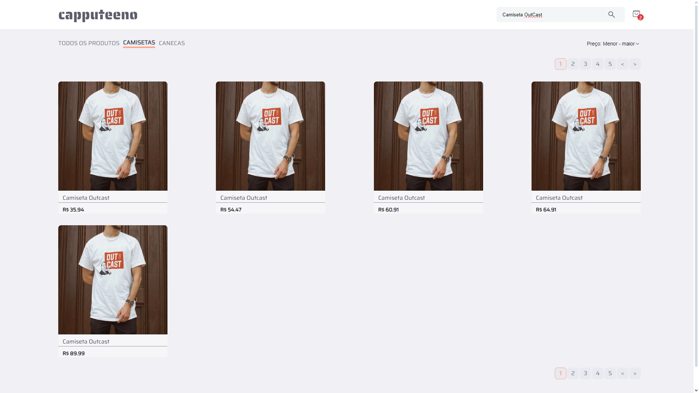

# ☕ Projeto Capputeeno ☕

### Commit: 08/09/2024 - 13:14 ( Adição do último filtro - Filtragem por página )

## Veja eu criando este commit no meu canal do youtube:
> <a href="https://youtu.be/7onYBK9bz-o" target="_blank">🔗 Projeto Capputeeno - Parte 6 - Filtro de páginas</a>

## ⚠️ IMPORTANTE!
### O desafio pede que a estilização seja feita com styled-components. Embora eu prefira estilizar com styled-components, usando react. Quando uso Next.js, prefiro estilizar com CSS Modules para garantir que a renderização no lado do servidor seja precisa.

# 

## 💭 Como o site está no momento atual com os filtros:

## ✔️ Alterações deste commit:

## Alterações na pasta: ( src )

## Alterações nas pastas de ( src ): ( app / assets / components / contexts / hooks )

### app:
- app > page.tsx: Adicionado um pequeno filtro, que se, estiver em "camisetas" ou "canecas" a filtragem de página não aparecerá.

### assets:
- assets: Adicionado a foto que mostra o site atual com a filtragem de páginas - (Imagem usada neste ReadMe).

### components:
- components > Nav > index.tsx: Adicionado a estilização para já iniciar o site com a marcação em "Todos os produtos".
- components > TogglePagination: Refatorado toda a estrutura do index.tsx para a nova versão com botões. E também alterado a estilização da tag "a" para "button".

### contexts:
- contexts > AppProvider: Adicionado o provider do TogglePagination.
- contexts > Filters > TogglePaginationContext.tsx: Criado todo o contexto para a troca de páginas.
- contexts > Filters > CategoryContext.tsx: Removido o useEffect (Usado para começar o site já marcado o "Todos os produtos" porém, não era eficiente o suficiente e arrumei um jeito melhor em: components > Nav > index.tsx).

### hooks:
- hooks > useGetDatas.tsx: Adicionado o parâmetro de "page" e "perPage" ao "AllProducts" além de alterar a chave da query para fazer a requisição ao fazer o cache.

##

### ❤️ Créditos:

#### Créditos do projeto à equipe da RocketSeat:
> <a href="https://github.com/Rocketseat/frontend-challenge" target="_blank">https://github.com/Rocketseat/frontend-challenge</a>

#### Créditos dos emojis: 
> <a href="https://emojipedia.org" target="_blank">https://emojipedia.org</a>

#### Créditos do Favicon: 
> <a target="_blank" href="https://icons8.com/icon/64677/tea-cup">Xícara de chá</a> ícone por <a target="_blank" href="https://icons8.com">Icons8</a>