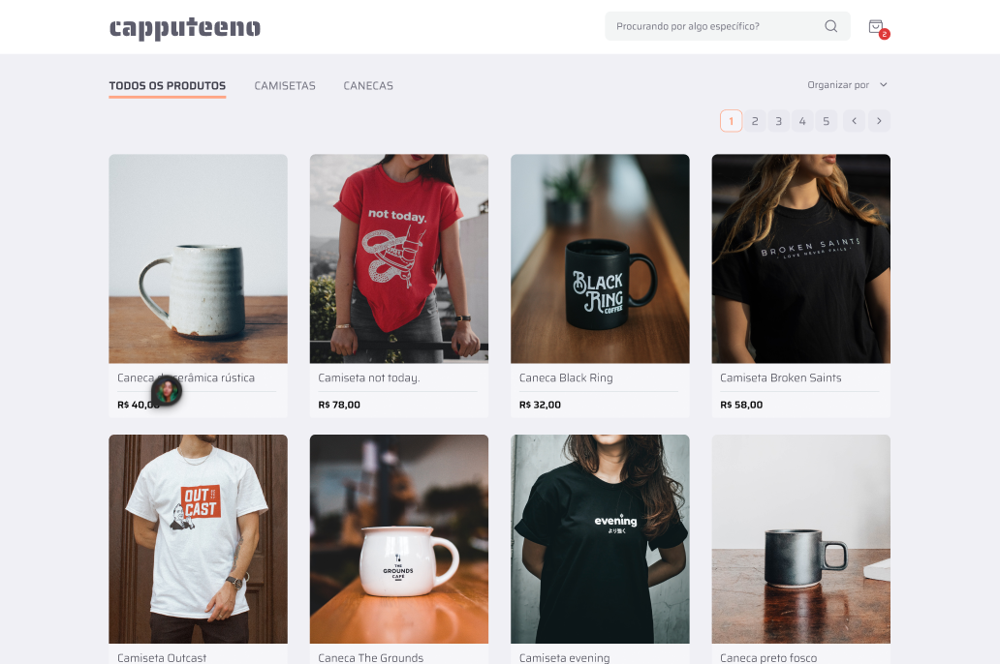
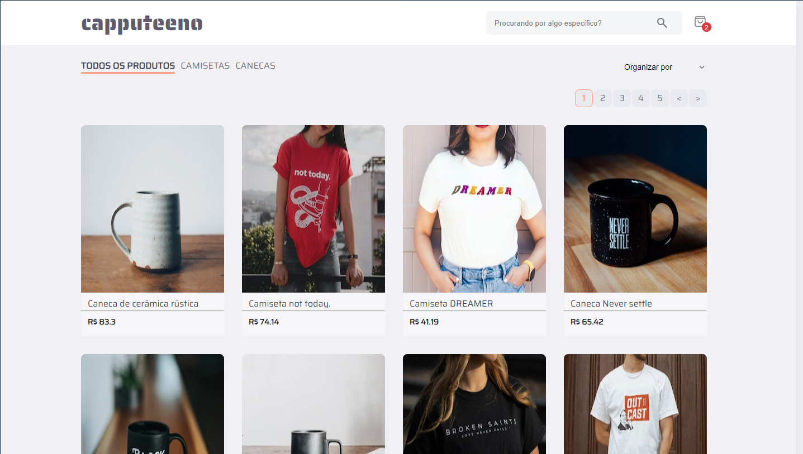
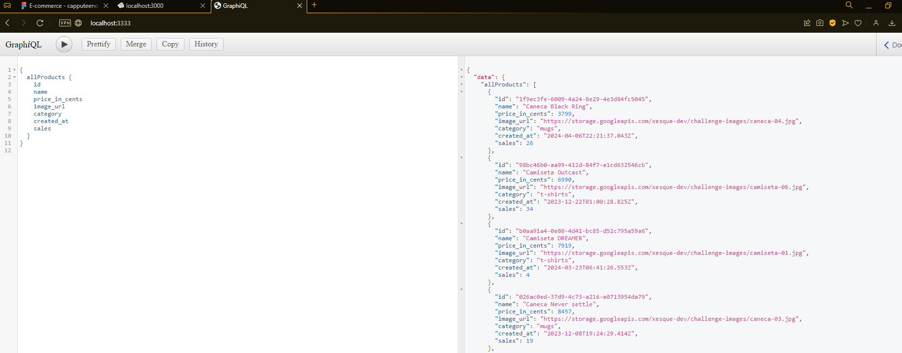

# ☕ Projeto Capputeeno ☕

> Commit: 19/08/2024 - 19:54 ( Commit de realização das requisições para a api GraphQL - Primeira parte)

## ⚠️ IMPORTANTE!
### O desafio pede que a estilização seja feita com styled-components. Embora eu goste bastante de estilizar com styled-components, usando react. Quando uso Next.js, prefiro estilizar com CSS Modules para garantir que a renderização no lado do servidor seja precisa.

# 

## 💭 Cards de objetivo:

## 💭 Meus card - primeira versão:

## 💭 Como é recebido os dados no GraphQL:

## ✔️ Alterações deste commit:

### Alterações nas pastas: ( src / next.config.mjs / package.json - package-lock.json )

### Alterações nas pastas de ( src ): ( api / app / assets / components / hooks / services / styles )

## api:
- api: Clonei o repositório do desafio e então recortei a pasta api para o meu projeto para conseguir usar a api GraphQL.
- api: Adicionei ao git ignore a pasta de node_modules e o package-lock.json

## app:
- app > layout.tsx: Adicionado o queryClientProvider para o react-query.
- app > page.tsx: Criado a estrutura da pasta inicial do site.

## assets:
- assets: Adicionado as duas fotos do site e a foto da api GraphQL para mostrar neste readme.

## components:
- components > Header / Nav: Editado a estilização de ambos, porém, uma alteração pequena. Eu apenas alterei o primeiro media query, para ele começar a funcionar com 1155px e não com 1024px para não quebrar o layout em relação aos cards.

## hooks: 
- hooks > useGetDatas.tsx: Criado a pasta hooks e o arquivo useGetDatas.tx para realizar a requisição api em um arquivo a parte e compartilhar o retorno com as outras partes do código.

## services:
- services > queryClient.tsx: Criado o queryClient para ir ao provider que está em app > layout.tsx.

## styles:
- styles > GlobalStyles.css: Como os cards estão em três partes do código eu decidi deixar como estilização global com um className especifico.

### Alterações da pasta ( next.config.mjs ):

## next.config.mjs:
- Adicionado as configurações para receber a imagem sem problemas, já que é de um host de fora.

### Alterações nas pastas de ( package.json - package-lock.json ):
- Instalado o react-query e o axios para fazer pegar os dados da api GraphQL prezando pela performance. 

##

#### Créditos dos emojis: 
> <a href="https://emojipedia.org" target="_blank">https://emojipedia.org</a>

#### Créditos do Favicon: 
> <a target="_blank" href="https://icons8.com/icon/64677/tea-cup">Xícara de chá</a> ícone por <a target="_blank" href="https://icons8.com">Icons8</a>