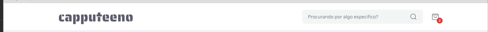
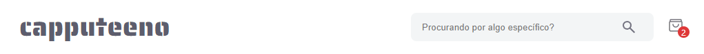

# ☕ Projeto Capputeeno ☕

> Commit: 16/08/2024 - 17:37 ( Commit da criação do Header )

## 💭 Header de objetivo:

## 💭 Meu Header

## ✔️ Alterações deste commit:

### Alterações nas pastas: ( src )
### Alterações nas pastas de ( src ): (app / assets / components / styles)

## app:
- app > layout.tsx: 
    - Importação das fontes: (Saira / Saira_Stencil_One)
    - Adicionado o Header como componente fixo de todas as páginas
    - Adicionado os estilos globais

## assets:
- assets: Adicionado as duas fotos dos headers para mostrar neste readme e adicionado o png da sacolinha que fica ao lado do input

## components:
- components > header: Criado o componente header e toda sua estilização e responsividade

## styles: 
- styles > GlobalStyles.css: Apenas adicionado o background-color e o box-shadow do corpo do site

##

#### Créditos dos emojis: 
> <a href="https://emojipedia.org" target="_blank">https://emojipedia.org</a>

#### Créditos do Favicon: 
> <a target="_blank" href="https://icons8.com/icon/64677/tea-cup">Xícara de chá</a> ícone por <a target="_blank" href="https://icons8.com">Icons8</a>