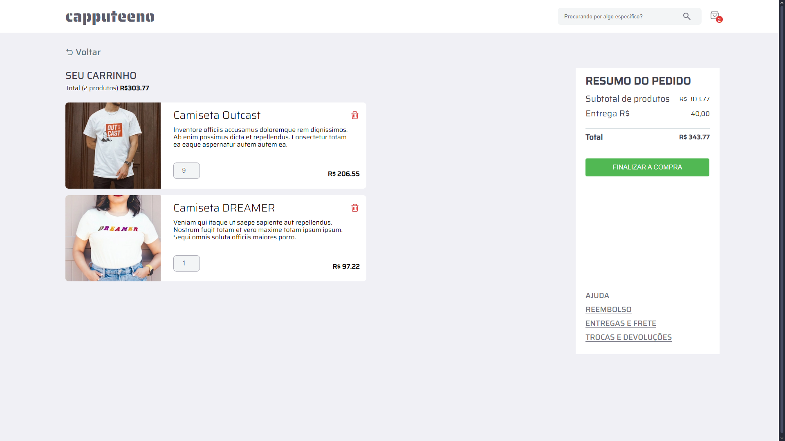

# ☕ Projeto Capputeeno ☕

### Commit: 09/10/2024 - 21:41 ( Criação da página de carrinho )

## ⚠️ IMPORTANTE!
### O desafio pede que a estilização seja feita com styled-components. Embora eu prefira estilizar com styled-components, usando react. Quando uso Next.js, prefiro estilizar com CSS Modules para garantir que a renderização no lado do servidor seja precisa.

# 

## 💭 Como o site está na página de carrinho:

## ✔️ Alterações deste commit:

## Alterações na pasta: ( src )

## Alterações nas pastas de ( src ): ( app / assets / contexts / hooks )

### app:
- app > (pages) > cartPage: Criado a pasta que possui a página de rota para o carrinho, mas está sem a parte lógica da página de carrinho.

### assets:
- assets > imagesForTheSite: Criado a pasta que irá armazenar as fotos que são usadas no site.

### contexts:
- contexts > Pages > CartContext.tsx: Adicionado novas funções que fazem parte do contexto do carrinho.

### hooks:
- hooks > apis > useGetCartProducts.tsx: Arquivo responsável por fazer as requisições somente para os produtos que estão no carrinho.
- hooks > Home: Criado a pasta home para adicionar os Hooks referentes a página Home.
- hooks > cartPageHook: Pasta para adicionar os Hooks da página do carrinho.
- hooks > cartPageHook > OrderSummary: Pasta responsável pela parte de resumo do pedido ( se localiza na parte direita da página de carrinho ).
- hooks > cartPageHook > ShowAllCartProducts: Pasta que armazena os cards dos produtos, que faz cada card de produto do carrinho.

##

### ❤️ Créditos:

#### Créditos do projeto à equipe da RocketSeat:
> <a href="https://github.com/Rocketseat/frontend-challenge" target="_blank">https://github.com/Rocketseat/frontend-challenge</a>

#### Créditos dos emojis: 
> <a href="https://emojipedia.org" target="_blank">https://emojipedia.org</a>

#### Créditos do Favicon: 
> <a target="_blank" href="https://icons8.com/icon/64677/tea-cup">Xícara de chá</a> ícone por <a target="_blank" href="https://icons8.com">Icons8</a>