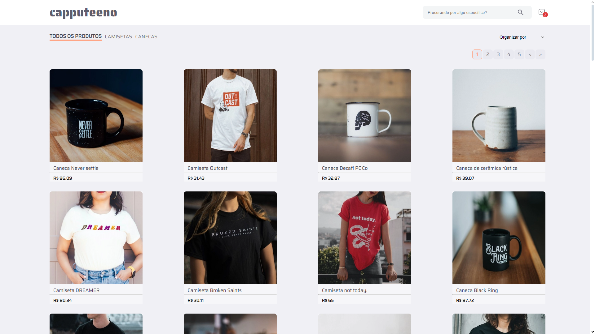

# ☕ Projeto Capputeeno ☕

Commit: 23/08/2024 - 11:14 ( Commit de refatoração de como é feito o filtro entre: "Todos os produtos" - "Camisetas" - "Canecas")
## Veja eu criando este commit no meu canal do youtube:
> 🔗 <a href="https://youtu.be/zHwa4Re80HA?si=mz793js-Erjw36yI" target="_blank">Projeto Capputeeno - Parte 1 - Criação dos filtros de categoria</a>

## ⚠️ IMPORTANTE!
### O desafio pede que a estilização seja feita com styled-components. Embora eu prefira estilizar com styled-components, usando react. Quando uso Next.js, prefiro estilizar com CSS Modules para garantir que a renderização no lado do servidor seja precisa.

# 

## 💭 Como o site está no momento atual:

## ✔️ Alterações deste commit:

### Alterações na pasta: ( src )

### Alterações nas pastas de ( src ): ( app / assets / components / contexts / hooks )

## app:
- app > layout.tsx: Adicionado o AppProvider para os contextos.
- app > page.tsx: Alterado o tamanho das fotos nos cards para 300px.

## assets:
- assets: Adicionado a foto do site como está atualmente para mostrar neste readme.

## components:
- components > Nav: Alterado a forma de como é disponibilizado as opções de filtros de categorias, de Link para Buttons e também estilizado esses novos botões.

## contexts:
- contexts: Criado o AppProvider.tsx para ir ao layout.tsx em app e criado também a pasta "Filters".
- contexts > Filters: Criado o arquivo: CategoryContext.tsx que contem todo o nosso contexto de filtro para a filtragem de produtos.

## hooks: 
- hooks > useGetDatas.tsx: Adicionado a filtragem se é "Todos os produtos" ou "Camisetas" / "Canecas".

## services:
- services > queryClient.tsx: Criado o queryClient para ir ao provider que está em app > layout.tsx.

## styles:
- styles > GlobalStyles.css: Como os cards estão em três partes do código eu decidi deixar como estilização global com um className especifico.

##

### ❤️ Créditos:

#### Créditos do projeto à equipe da RocketSeat:
> <a href="https://github.com/Rocketseat/frontend-challenge" target="_blank">https://github.com/Rocketseat/frontend-challenge</a>

#### Créditos dos emojis: 
> <a href="https://emojipedia.org" target="_blank">https://emojipedia.org</a>

#### Créditos do Favicon: 
> <a target="_blank" href="https://icons8.com/icon/64677/tea-cup">Xícara de chá</a> ícone por <a target="_blank" href="https://icons8.com">Icons8</a>