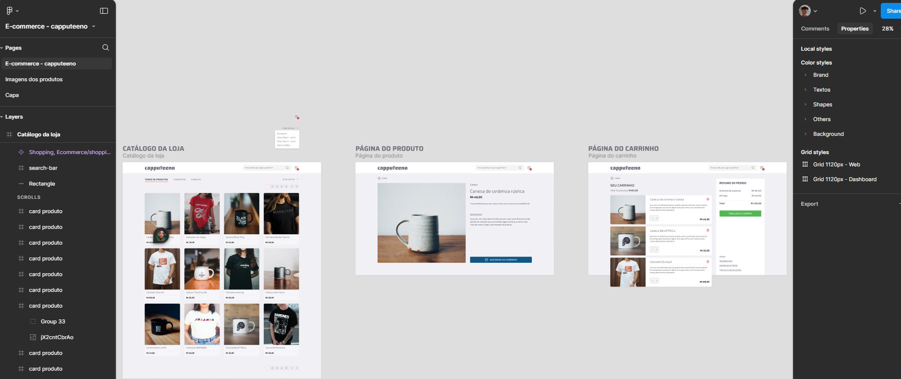

# ☕ Projeto Capputeeno ☕

> Commit: 15/08/2024 - 20:48 ( Commit para iniciar o projeto )

## 💭 Objetivo:

## 📌 Sobre o projeto:

### Este projeto é um desafio proposto neste repositório:
> <a href="https://github.com/Rocketseat/frontend-challenge" target="_blank">https://github.com/Rocketseat/frontend-challenge</a>

##

#### Créditos dos emojis: 
> <a href="https://emojipedia.org" target="_blank">https://emojipedia.org</a>

#### Créditos do Favicon: 
> <a target="_blank" href="https://icons8.com/icon/64677/tea-cup">Xícara de chá</a> ícone por <a target="_blank" href="https://icons8.com">Icons8</a>