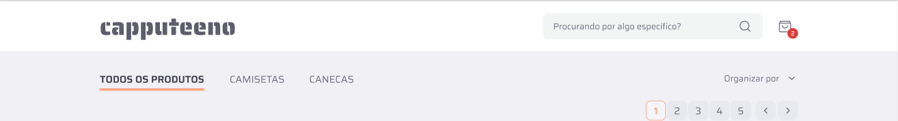
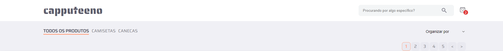

# ☕ Projeto Capputeeno ☕

> Commit: 17/08/2024 - 15:58 ( Commit da criação do Nav )

## ⚠️ IMPORTANTE!
### O desafio pede que a estilização seja feita com styled-components. Embora eu goste bastante de estilizar com styled-components, usando react. Quando uso Next.js, prefiro estilizar com CSS Modules para garantir que a renderização no lado do servidor seja precisa.

# 

## 💭 Nav de objetivo:

## 💭 Meu Nav

## ✔️ Alterações deste commit:

### Alterações nas pastas: ( src )
### Alterações nas pastas de ( src ): (app / assets / components)

## app:
- app > (pages) > (navLinks) > [[id] / Mugs / TShirts]: Todas essas pastas foram criadas, porém, sem conteúdo por enquanto.
- app > [id] > page.tsx: Também criado mas sem conteúdo por hora.

## assets:
- assets: Adicionado as duas fotos do nav para mostrar neste readme.

## components:
- components > nav: Criado o componente nav e toda sua estilização e responsividade

##

#### Créditos dos emojis: 
> <a href="https://emojipedia.org" target="_blank">https://emojipedia.org</a>

#### Créditos do Favicon: 
> <a target="_blank" href="https://icons8.com/icon/64677/tea-cup">Xícara de chá</a> ícone por <a target="_blank" href="https://icons8.com">Icons8</a>