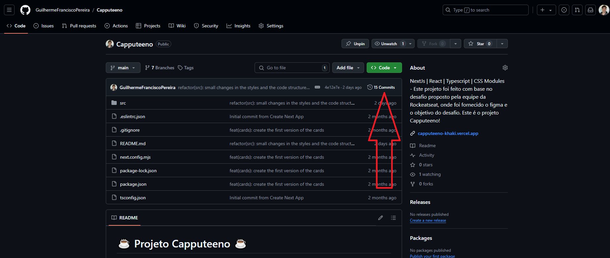
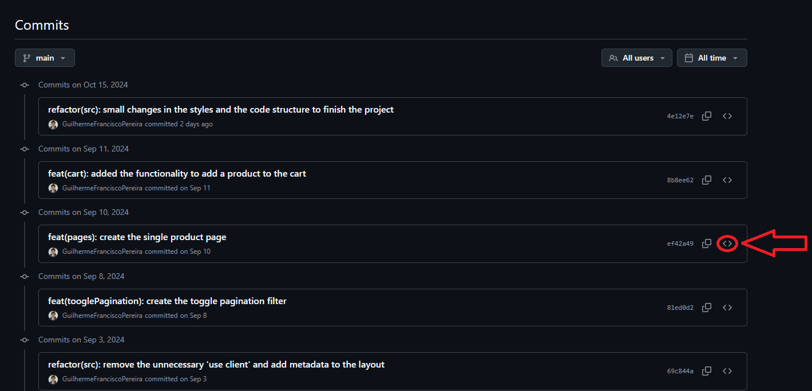
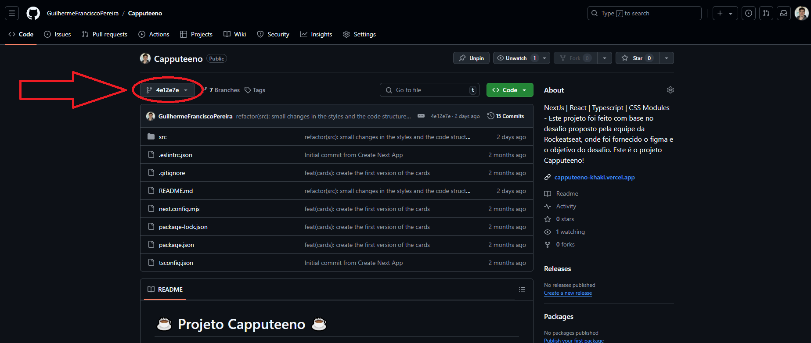

# ☕ Projeto Capputeeno ☕

## 📌 Sobre o projeto

### Este projeto foi um desafio proposto pela equipe da Rockeatseat, onde foi fornecido o figma e o objetivo do desafio, onde deveria ser implementado um e-commerce para venda de canecas e camisetas. 

## 🧠 Critérios de Avaliação
- ✔️ Catálogo de produtos com paginação
- ✔️ Filtragem produtos por categoria
- ✔️ Busca por nome do produto
- ✔️ Adicionar e remover produtos do carrinho
- ✔️ Siga o protótipo do figma
- ✔️ Utilize Next.js e Typescript
- ✔️ Utilize o local storage para gerenciar o carrinho
- ✔️  Consuma nossa API GraphQL rodando o comando yarn start na pasta api
- ❌ Faça a estilização com styled-components:
    - ⚠️ O desafio pede que a estilização seja feita com styled-components. Embora eu prefira estilizar com styled-components, usando react. Quando uso Next.js, prefiro estilizar com CSS Modules para garantir que a renderização no lado do servidor seja precisa.

##

# 

## 🖥 Versão do site no PC


## 📱 Versão do site no Mobile


## 💭 Como está o LocalStorage


##

#

## 🖥 Tecnologias Utilizadas
<div align='center'>


</div>

    - Next
    - React
        - React-query
        - Axios
    - Typescript
    - Css Modules

## Versões utilizadas:
    - Next: 14.2.5
    - React: 18
        - React-query: 3.39.3
        - Axios: 1.7.4
    - Typescript: 5

## 🙋🏻‍♂ Como me localizar no projeto?

### Todos os arquivos de código fonte do projeto estão em: `./src`

## 🛈 Como o projeto está estruturado

- `./src/api:` Neste pasta se localiza a api GraphQL proposta pela equipe da RockeatSeat. Esta api contem os produtos do E-Commerce.

- `./src/app:` Este projeto é em Next e usando o App Router, então cada pasta é uma rota. Dentro do app temos: 
  - layout.tsx: Importa estilos globais e fontes, configura metadados (como título e descrição), e encapsula a aplicação com nossos contextos.
  - page.tsx: Nossa primeira rota, também chamado como o nosso "home"
  - Pasta (pages) que armazena nossas duas rotas: 
    - cartPage: Página de carrinho.
    - produtos: Responsável pela página de cada produto único.

- `./src/assets:` Onde está todas as fotos e arquivos estáticos que vão ser usadas no projeto.

- `./src/components:` Onde está os componentes que serão reutilizados em diversas partes do código. Neste projeto temos os components:
    - Botões: Buttons
    - Cabeçalho: Header
    - Navegação do site: Nav
    - Responsável por trocar entre ás páginas: TogglePagination

- `./src/contexts:` Os contexts são onde separamos os dados que serão compartilhados com toda a aplicação, neste projeto na primeira versão é onde está os contextos de:
  - Filtro ( pasta: Filters).
  - De cada página ( pasta: Pages )
  - Vale ressaltar que o arquivo 'AppProvider.tsx' é o responsável por agrupar todos os providers dos contextos e exportar como um arquivo único. 

- `./src/hooks:` Está nossos hooks personalizados com as partes lógicas da aplicação. 

- `./src/services:` Pasta que contém as funcionalidades de serviço. Com a primeira versão temos um único arquivo "QueryClient.ts" que serve somente para criarmos um QueryClient e exportar o provider neste próprio arquivo, uma vez que assim podemos usar a diretiva 'use client' no arquivo e não no layout da aplicação.

- `./src/styles:` Pasta que contém os arquivos de estilização. Nesta primeira versão temos também um único arquivo, chamado "GlobalStyles.css", este arquivo fica responsável pelos códigos que são de estilização globais do projeto.

## ❔ Como rodar o projeto na minha máquina?

- Antes de tudo, você precisa ter o Git instalado no seu computador. O Git é uma ferramenta que permite clonar e gerenciar repositórios de código.
    - Windows: Baixe o Git <a href="https://git-scm.com/download/win" target="_blank">aqui</a> e siga as instruções de instalação.
    - macOS: Você pode instalar o Git <a href="https://git-scm.com/download/mac" target="_blank">aqui</a> ou usando o Homebrew com o comando brew install git:
        ```bash
        brew install git
        ```
        
    - Linux: Use o gerenciador de pacotes da sua distribuição, por exemplo para Debian/Ubuntu:
        ```bash
        sudo apt install git
        ```
        

- Abra o terminal (no Windows, você pode usar o Git Bash, que é instalado junto com o Git).

- Navegue até o diretório onde deseja armazenar o projeto.

- Execute o comando para clonar o repositório:

    ```bash
    git clone https://github.com/GuilhermeFranciscoPereira/Capputeeno.git
    ```
    
- Após clonar o repositório, navegue até a pasta do projeto
    ```bash
    cd Capputeeno
    ```
    

- Agora você pode abrir os arquivos do projeto com seu editor de texto ou IDE preferido. Exemplo do vsCode: 
    ```bash
    code .
    ```

- 🚨 Não esqueça que para não ocorrer erros no código ao clonar ele, você deve fazer o comando abaixo 🚨
    ```bash
    npm i   
    ```
    
- Ao ter o projeto na sua máquina você deve abrir a api e também o site. Para isso siga os passos abaixo:
  - Abra o terminal e escreva o código abaixo para iniciar a api:
    - 1:
      ```bash
      cd src/api
        ```
      
    - 2:
        ```bash
        npm start
        ```
      
  - Para abrir o site rode o comando:
    ```bash
    npm run dev
    ```
    

- Pronto! Todo o site estará funcionado na sua máquina. Porém, caso precise de alguma ajuda em algo entre em contato comigo pelo meu LinkedIn: https://www.linkedin.com/in/guilherme-francisco-pereira-4a3867283

## ⚠️ Informações importantes sobre o projeto ⚠️

### Todos os commits do projeto possuem um readme detalhado do que foi feito naquele commit e também possuem as fotos versão do site naquele momento, então caso deseje ver o processo de criação do código viaje pelos commits e veja as informações!

### Como fazer isso? 

Para você ver o processo de criação e o que foi feito em cada commit siga o passo-a-passo:

#### Primeiro: Nessa guia em que você está, suba a tela até encontrar embaixo do botão verde um local igual o da foto abaixo e então clique nele


#### Segundo: No lado direito dos commits você encontra clique no simbolo de <> como está na foto e então você irá encontrar como o código estava naquele momento e o readme detalhado daquele momento!


#### Terceiro: Depois de encontrar tudo que deseja, caso queira voltar para cá, você irá clicar no local em que a imagem a baixo mostra:


#### E então clique em main e voltará para cá!

##

## 🎉 É isso! Esse foi o nosso desafio, caso tenha ficado com alguma dúvida ou deseje complementar algo diretamente comigo você pode estar entrando em contato através do meu LinkedIn:
> Link do meu LinkedIn: <a href="https://www.linkedin.com/in/guilherme-francisco-pereira-4a3867283" target="_blank">https://www.linkedin.com/in/guilherme-francisco-pereira-4a3867283</a>

### 🚀 Obrigado pela atenção e espero que tenha gostado do que tenha visto aqui, que tal agora dar uma olhada nos meus outros repositórios? 👋🏻

#

### ❤️ Créditos:

#### Créditos do projeto à equipe da RocketSeat:
> <a href="https://github.com/Rocketseat/frontend-challenge" target="_blank">https://github.com/Rocketseat/frontend-challenge</a>

#### Créditos dos emojis: 
> <a href="https://emojipedia.org" target="_blank">https://emojipedia.org</a>

#### Créditos do Favicon: 
> <a target="_blank" href="https://icons8.com/icon/64677/tea-cup">Xícara de chá</a> ícone por <a target="_blank" href="https://icons8.com">Icons8</a>

- #### Créditos dos badges: 
> <a href="https://shields.io" target="_blank">https://shields.io</a>